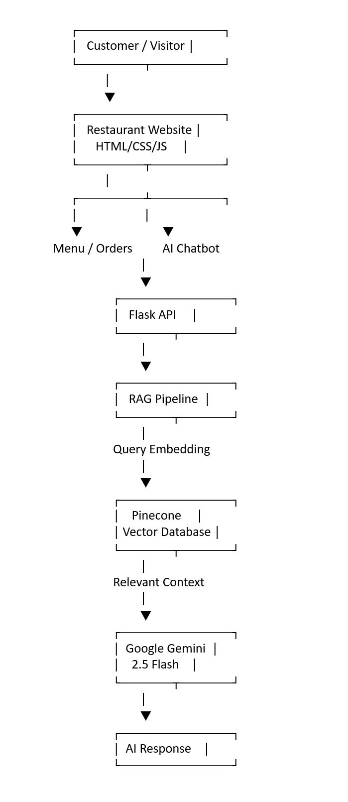
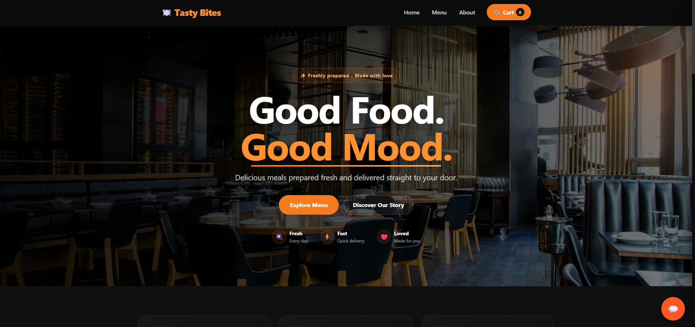
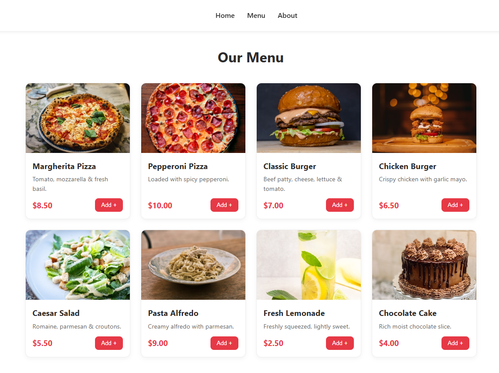
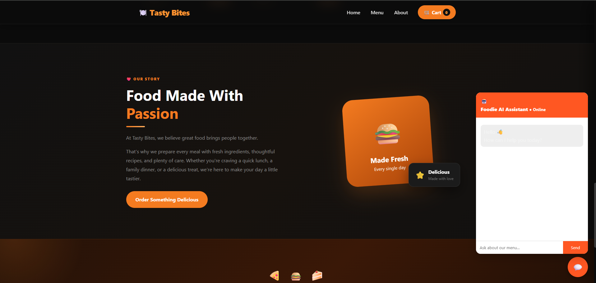
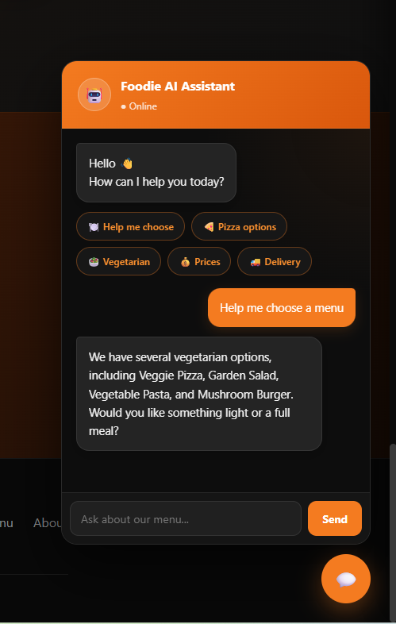
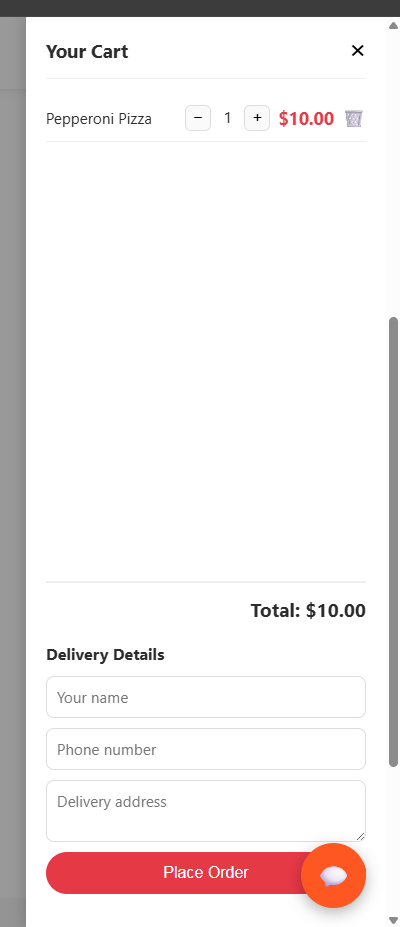
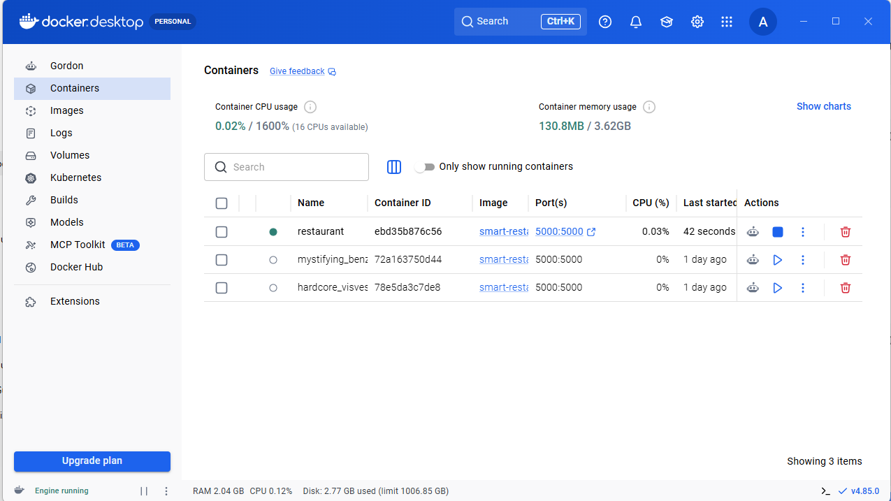

# 🍽️ Foodie AI Restaurant Chatbot

> An intelligent restaurant website powered by Retrieval-Augmented Generation (RAG), Google Gemini, Pinecone Vector Database, Flask, and Docker.

---

## 📖 Project Overview

Foodie AI Restaurant Chatbot is a complete restaurant web application that allows visitors to

- Browse the restaurant menu
- Place food orders
- Chat with an AI assistant
- Ask questions about menu items
- Receive answers based only on the restaurant knowledge base

Unlike traditional chatbots, this project uses Retrieval-Augmented Generation (RAG) to retrieve relevant information before generating responses.

---

## ✨ Features

- Restaurant landing page
- Interactive menu
- Online ordering system
- AI chatbot
- Conversation memory
- Retrieval-Augmented Generation (RAG)
- Pinecone Vector Database
- Google Gemini 2.5 Flash
- Semantic Search
- Docker support
- REST API using Flask

---

## 🛠 Tech Stack

| Category | Technology |
|-----------|------------|
| Backend | Flask |
| Frontend | HTML, CSS, JavaScript |
| LLM | Google Gemini 2.5 Flash |
| Embeddings | Google text-embedding-004 |
| Vector Database | Pinecone |
| AI Framework | LangChain |
| Containerization | Docker |
| Version Control | Git & GitHub |

---

# 📂 Project Structure

```text
Restaurant/
│
├── chatbot/
├── data/
├── docs/
├── static/
├── tests/
├── app.py
├── Dockerfile
├── requirements.txt
├── README.md
└── .env
```

---

# 🧠 System Architecture



---

# 📷 Screenshots

## Homepage



---

## Menu



---

## AI Chatbot



---

## AI Response



---

## Order System



---

## Docker



---

# 🚀 Installation

Clone the repository

```bash
git clone https://github.com/Hozayfa-Ahsan/smart-restaurant.git
```

Go inside

```bash
cd smart-restaurant
```

Install packages

```bash
pip install -r requirements.txt
```

Create a `.env` file

```text
GOOGLE_API_KEY=YOUR_API_KEY
PINECONE_API_KEY=YOUR_API_KEY
PINECONE_INDEX_NAME=foodie
```

Run

```bash
python app.py
```

Open

```
http://127.0.0.1:5000
```

---

# 🐳 Docker

Build

```bash
docker build -t smart-restaurant .
```

Run

```bash
docker run --env-file .env -p 5000:5000 smart-restaurant
```

---

# 📌 Future Improvements

- User authentication
- Admin dashboard
- Database integration
- Online payment gateway
- Reservation system
- Voice-enabled chatbot
- Multi-language support

---

# 👨‍💻 Author

**Hozayfa Ahsan**

GitHub:

https://github.com/Hozayfa-Ahsan

---

# 📜 License

This project is released under the MIT License.
